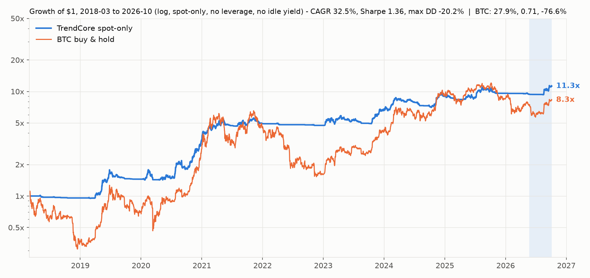
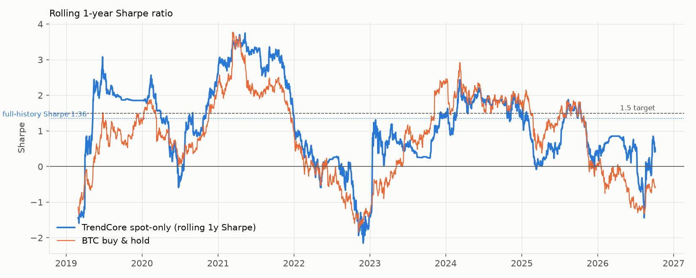
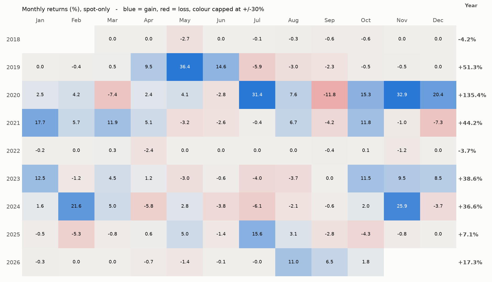
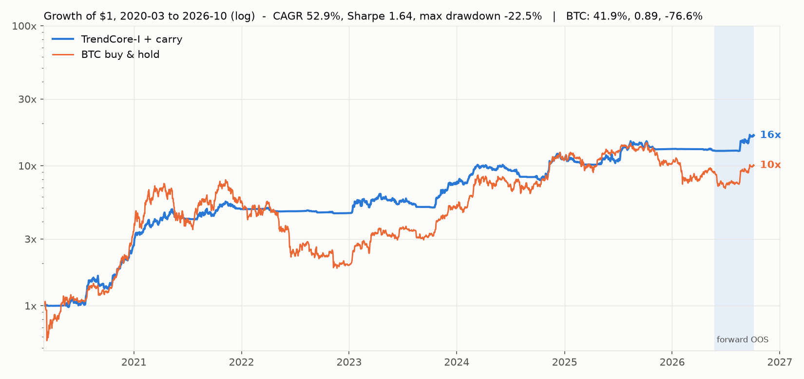
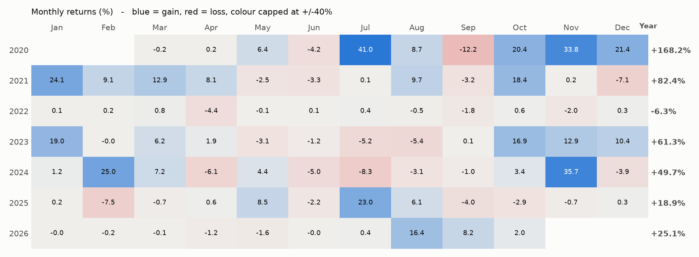
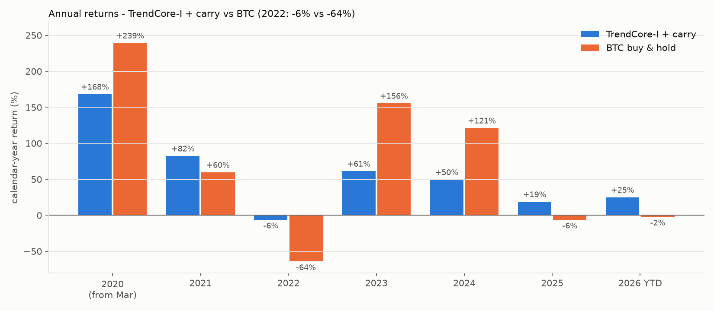
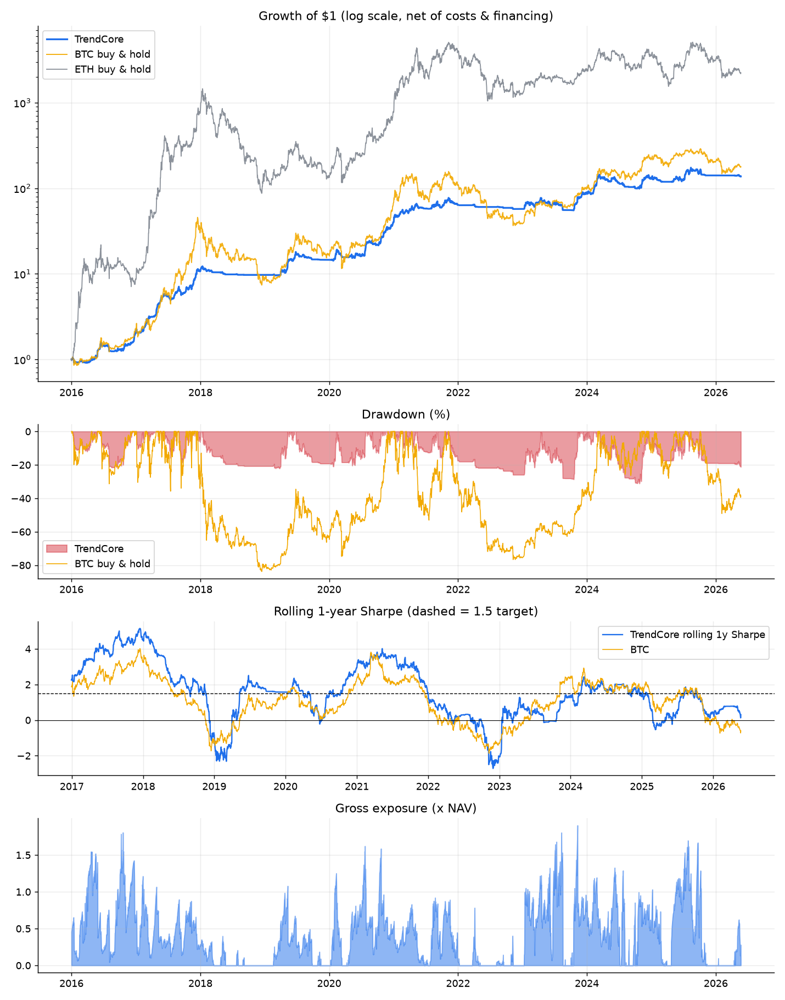
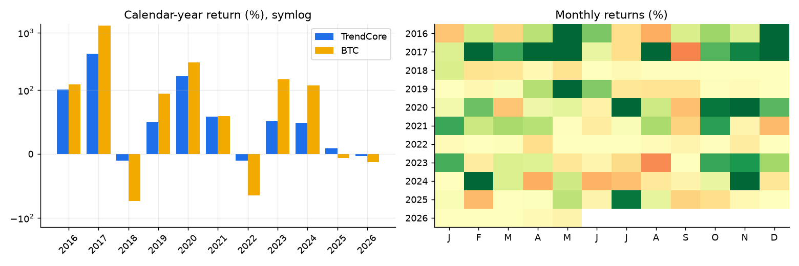
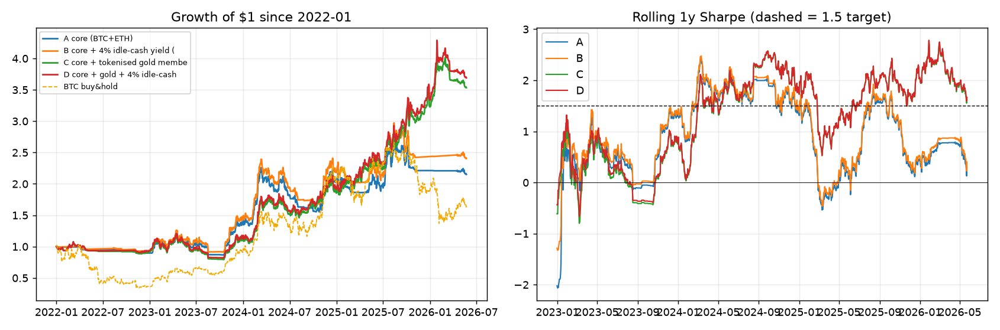

# TrendCore - a volatility-targeted, regime-gated crypto trend strategy

> ## OFFICIAL VERSION: SPOT-ONLY, LONG-ONLY, NO LEVERAGE (`quant.intraday.spot_only()`)
> **Full history 2018-03 -> 2026-10, no idle yield: CAGR 32.5 %, Sharpe 1.36, Sortino 1.58, max DD -20.2 %** (BTC buy & hold same period: 27.9 %, 0.71, -76.6 %).
> 
> 
> 
> Table below was measured from 2020-03.
> Constraint: only spot BTC/ETH, never more than 100 % of capital invested, no shorts, no perps/futures, no borrowing, no carry sleeve.
> (The figures in the "Round 3 headline" box below used perp carry and up to 1.5x leverage - they do **not** meet this constraint and are kept only for reference.)
>
> | Window | CAGR | Sharpe | Sortino | Max DD |
> |---|---|---|---|---|
> | 2020-03 -> 2026-10 | **36.1 %** | **1.45** | 1.78 | **-19.2 %** |
> | 2022+ | 19.0 % | 1.00 | 1.20 | -19.2 % |
> | 2023+ | 25.9 % | 1.17 | 1.56 | -19.2 % |
> | Forward OOS 2026-05-24 -> 10-05 (4.5 months) | 62.8 % ann. | 2.40 | 3.54 | -5.2 % |
> | + optional 4 % stablecoin-earn yield on idle cash (2020-03+ / 2022+) | 39.8 % / 22.4 % | 1.56 / 1.14 | 1.91 / 1.37 | -18.0 % |
> | (reference) daily TrendCore, spot-only, 2016-2026 | 49.8 % | 1.66 | - | -27.8 % |
>
> Calendar years: 2020 +132 % | 2021 +44 % | 2022 -3.7 % | 2023 +39 % | 2024 +37 % | 2025 +7 % | 2026 YTD +17 %. Average exposure since 2022 is only 0.29 of capital (flat 36 % of the time).
> Validation (`python validate_spot.py`): placebo mean Sharpe 0.52, max 1.27 vs 1.45 (p < 0.01); 13 neighbouring settings Sharpe 1.34-1.52 (2022+: 0.88-1.12);
> costs x4 -> 1.29; +24 h execution lag -> 1.41; bootstrap 90 % CI [0.74, 2.15] (2022+: [0.22, 1.68]).
> **Honest limits:** without leverage the risk dial is limited (next paragraph): ~42 % CAGR at -29 % drawdown is where it saturates and Sharpe stays flat, so a 50 % CAGR is not reachable
> in the post-2022 regime this way. Ceiling for this design family is roughly BTC-like returns at ~1/3 of BTC's drawdown.
>
> **Risk dial (same signals; only the per-asset risk budget `ASSET_VOL` changes; 2018-03 -> 2026-10, no idle yield; CAGR / Sharpe / max DD):**
> 0.30 -> 22.1 % / 1.34 / -16.3 % | **0.45 (official) -> 32.5 % / 1.36 / -20.2 %** | 0.60 -> 38.9 % / 1.40 / -22.8 % (2022+: 24.1 % / 1.06; 2023+: 34.1 % / 1.28) | 0.80 -> 40.6 % / 1.38 / -24.5 % | 1.50 -> 42.2 % / 1.35 / -28.6 %.
> Sharpe stays 1.25-1.45 over the whole grid, i.e. the dial buys CAGR with drawdown, not alpha (a constant BTC core is worse than the dial). 0.60 survives costs x4 (Sharpe 1.23) and a 24 h lag (1.23); 0.80 does not (DD about -29 %). In 2022 0.60 loses -7.4 % vs -3.7 %.
> Set `ASSET_VOL` in `trendcore_spot.py` (default 0.45). Chart: `results/frontier_spot.png`; table `results/dial_grid.csv`; validation `results/dial_validation.log`.


> ## (Reference only - NOT spot-only) Round 3 headline - TrendCore-I + perp carry, up to 1.5x leverage
>
> | Window | CAGR | Sharpe | Sortino | Max drawdown |
> |---|---|---|---|---|
> | **2020-03 -> 2026-10 (full intraday sample)** | **52.9 %** | **1.64** | 2.23 | **-22.5 %** |
> | 2021+ | 37.0 % | 1.34 | 1.82 | -22.5 % |
> | 2022+ (the weak regime) | 29.0 % | **1.16** (was 0.78) | 1.58 | -22.5 % |
> | 2023+ | 40.4 % | 1.37 | 1.97 | -22.5 % |
> | **Forward OOS 2026-05-24 -> 10-05** (never used in any design choice, 4.5 months) | 96 % ann. | 2.52 | 4.00 | -6.5 % |
> | BTC buy & hold 2020-03+ | 41.9 % | 0.89 | - | -76.6 % |
>
> **All three original targets are met over 2020-2026** (CAGR >= 50 %, Sharpe > 1.5, drawdown -22.5 % vs BTC's -76.6 %).
> **2022+ is still short of 1.5** (1.16; 90 % bootstrap CI [0.37, 1.84], P(Sharpe > 1.5) ~ 21 %) - the improvement from 0.78 to 1.16 is real
> but I will not claim 1.5 in that regime. Calendar years: 2020 +168 % | 2021 +82 % | 2022 **-6.3 %** (BTC -64 %) | 2023 +61 % | 2024 +50 % | 2025 +19 % (BTC -6 %) | 2026 YTD +25 % (BTC -2 %).
>
> **What the intraday data changed (and what it did not).** Data: Binance spot/perp 1h klines, funding, open interest from the official public archive
> (`data.binance.vision`; the live API refuses this server's region, HTTP 451 - no keys are used or needed).
> 1. **6-hour decision bars + hourly realised-vol sizing** (same signals, all look-backs scaled): 2022+ Sharpe 0.89 -> 1.05; plateau over 4h/6h/8h/12h bars.
> 2. **Open-interest crowding overlay** (exposure x (1 - 0.5 x clip(z,0,2)/2), z = 1-year z-score of BTC futures OI): Sharpe up and drawdown down in *both* eras at every strength tested (monotone), adopted at the pre-set midpoint. Only ~5 years of OI history exist.
> 3. **Delta-neutral funding/basis carry on idle capital** (long spot / short perp, real funding): +0.07-0.10 Sharpe. Funding has decayed (BTC short-perp funding 30 % in 2021 -> 4 %, 8 %, 12 %, 5 %, 2 % in 2022-26), so it is a ~5-6 % cash-yield substitute now, not an alpha engine. Its tiny daily vol (Sharpe 8-12 on daily bars) hides exchange/ADL/liquidation risk - treat it as ordinary carry risk.
> 4. **Rejected on the same data:** hourly mean-reversion (real IC -0.05, but gross Sharpe ~0 and breakeven cost < 0), order-flow imbalance / perp premium / funding-level predictors (no stable IC), rotating carry into high-funding coins (worse than BTC/ETH), tokenised gold stays optional. See `research/RESEARCH_LOG.md` #40-46.
>
> Validation (`python validate_intraday.py`, [`results/validation_intraday.json`](results/validation_intraday.json)): **placebo** (weights shifted against returns) mean Sharpe 0.71, max 1.44 vs actual **1.64** (p < 0.01);
> **plateau** over 12 one-at-a-time changes: Sharpe 1.54-1.87 (2022+: 1.05-1.34); **stress**: 4x costs 1.44, +6 h lag 1.55, +24 h lag 1.51, 2x costs + lag + 20 % financing 1.48, no leverage at all (cap 1.0) 1.70 / CAGR 44.5 % / DD -17.4 %;
> bootstrap 90 % CI full sample [0.95, 2.33]. Risk dial: vol target 0.25 -> CAGR 41 %, Sharpe 1.87 (2022+: 1.34), DD -18 %; 0.30 -> 46 %, 1.79, -21 %; **0.40 (default) -> 53 %, 1.64, -22.5 %**.
> Caveats: still only ~6.5 years of intraday data; one forward window of 4.5 months proves little; parameter choices (6h, OI strength 0.5, vol target 0.40) were made after seeing results on the sample, with plateau checks as the guard; Binance-only data and execution; carry carries exchange/counterparty risk.
>
> 
> 
> 
>
> Code: [`quant/intraday.py`](quant/intraday.py) (TrendCore-I), [`quant/carry.py`](quant/carry.py), `scripts/fetch_vision.py` / `fetch_metrics.py` (downloaders), `validate_intraday.py`.
> The sections below describe the original **daily** TrendCore (2016-2026, CoinMetrics data) and the round-2 analysis.


Long-only BTC + ETH trend following with ex-ante volatility targeting, tested on **real daily data
(CoinMetrics, 2010 - 2026-05-23)** with fees, slippage and financing charged, and validated with a
battery of anti-overfitting tests.

> **Read this first - honest scorecard against the challenge targets**
>
> | Target | 2016-2026 (full) | 2017-2026 | 2018-2026 | 2022-2026 |
> |---|---|---|---|---|
> | CAGR >= 50 % | **60.5 %** | **56.6 %** | 35.3 % | 19.1 % |
> | Sharpe > 1.5 | **1.73** | **1.66** | 1.21 | 0.78 |
> | Max drawdown (minimal) | **-31.1 %** (BTC: -83.8 %) | -31.1 % | -31.1 % | -31.1 % |
>
> The three targets are met on the full 10-year history and on 2017+, with a drawdown roughly one third of
> BTC's. They are **not** met on windows that exclude the 2016-17 bubble (2018+: Sharpe 1.2, CAGR 35 %) or in the
> post-2022 regime (Sharpe 0.8). I could not find - despite ~350 backtests of alternatives (see
> [`research/RESEARCH_LOG.md`](research/RESEARCH_LOG.md)) - any robust, honestly-testable edge that lifts the
> recent regime to Sharpe 1.5 with the data available (daily closes, no funding/order-book data).
> I would rather report that than present a curve-fit number. Expect forward Sharpe nearer 1.0-1.3 than 1.7.
> **Round 2** (see below) attacked the 2022-26 weakness directly: the hindsight ceiling of this strategy family in that window is Sharpe ~1.2.




## Results (net of costs, financing; no cash yield)

Config: vol target 35 %, vol-scalar cap 1.5, gross <= 2x NAV, 10 bp one-way (BTC/ETH), 10 %/yr financing on
borrowed notional, signal at 00:00-UTC close -> traded same close (stress-tested with 1-2 day lag below).

| | CAGR | Sharpe | Sortino | MaxDD | Vol | Calmar |
|---|---|---|---|---|---|---|
| **TrendCore 2016-2026** | 60.5 % | 1.73 | 2.15 | -31.1 % | 30.0 % | 1.94 |
| TrendCore 2017-2026 | 56.6 % | 1.66 | 2.05 | -31.1 % | 29.6 % | 1.82 |
| TrendCore 2018-2026 | 35.3 % | 1.21 | 1.46 | -31.1 % | 28.3 % | 1.13 |
| TrendCore 2020-2026 | 42.0 % | 1.32 | 1.64 | -31.1 % | 30.0 % | 1.35 |
| TrendCore 2022-2026 | 19.1 % | 0.78 | 0.89 | -31.1 % | 27.2 % | 0.61 |
| BTC buy & hold 2016-2026 | 64.6 % | 1.08 | 1.45 | -83.8 % | 66.9 % | 0.77 |
| ETH buy & hold 2016-2026 | 109.9 % | 1.24 | 1.86 | -94.0 % | 97.5 % | 1.17 |
| 50/50 BTC/ETH 2016-2026 | 98.8 % | 1.30 | 1.78 | -88.0 % | 74.6 % | 1.12 |

**What the strategy is and is not.** It is a *risk-reduction* machine: it earns BTC-like CAGR at ~45 % of BTC's
volatility and ~37 % of its drawdown, which is why Sharpe/Calmar are far higher. It does **not** beat
buy-and-hold ETH or BTC on raw return in this sample (crypto went up ~100-2000x); a buy-and-hold investor
would have had to sit through -84 % / -94 % drawdowns.

Calendar years: 2016 +104 % | 2017 +432 % | 2018 -10 % | 2019 +50 % | 2020 +175 % | 2021 +59 % | 2022 -10 % |
2023 +51 % | 2024 +49 % | 2025 +9 % | 2026 YTD -3 %.  Rolling 1-year windows: 86 % positive, median +51 %,
10th percentile -5.8 %, worst -25.9 %, median rolling Sharpe 1.58.

### Risk dial (same strategy, different volatility target) - [`results/risk_dial.csv`](results/risk_dial.csv)

| vol target | CAGR 2016+ | Sharpe | MaxDD | CAGR 2018+ | Sharpe 2018+ |
|---|---|---|---|---|---|
| 20 % | 33.4 % | 1.60 | -22.5 % | 19.6 % | 1.09 |
| 25 % | 42.0 % | 1.64 | -26.7 % | 23.8 % | 1.10 |
| 30 % | 50.8 % | 1.67 | -28.2 % | 28.5 % | 1.13 |
| **35 % (default)** | 60.5 % | 1.73 | -31.1 % | 35.3 % | 1.21 |
| 50 % | 75.7 % | 1.70 | -37.1 % | 42.8 % | 1.18 |

Sharpe is ~flat across the dial: the target is a pure risk-appetite choice. Return and drawdown scale together.

## Round 2 - attacking the weak 2022-2026 window (what I tried, what is honest)

2022-26 (Sharpe 0.78) is weak because BTC itself is weak there (buy&hold Sharpe 0.48) and only ~4 independent trend legs occurred
(the system captured the big ones - e.g. +103 % vs BTC's +101 % in Oct-2023 -> Jul-2024 - and bleeds in many small chop episodes).
I ran ~170 further backtests aimed at this window (full list: [`research/RESEARCH_LOG.md`](research/RESEARCH_LOG.md) #28-39).

**1. The ceiling is ~1.2, even with hindsight.** I ran 105 single long-only trend rules (SMA / momentum / EWMAC / Donchian, 9-12 speeds each,
with and without a 100/200-day gate) on BTC+ETH, vol-targeted, and looked at the *best-in-hindsight* 2022-26 Sharpe:
**max 1.22**, 90th percentile 0.89, median 0.60 (`results/ceiling_grid.csv`). The rank of a rule in 2018-21 is only 0.26-correlated with its
rank in 2022-26, so "pick the winner" is noise. **Sharpe 1.5 in this window is not reachable by this family of strategies - not even by overfitting it.**

**2. What failed again (adding to round 1):** rebounds after liquidation cascades (there is none - 5-day forward returns are *negative*),
shock circuit-breakers, stretch/overbought trims, rising-SMA / golden-cross / 365-day gates, trend-quality (slope t-stat) signals, chandelier exits,
smoothing and hysteresis, BTC-heavier weights, ETH relative-strength gating, walk-forward adaptive speed tilting, and **a gated bear-regime short sleeve**
(+47 % in 2018 and +6 % in 2022, but it gives it all back in bull years: Sharpe 0.58 vs 0.78 in 2022-26).
One candidate (SMA50 second gate + "ETH only when BTC is up") scored **1.03** in 2022-26 - and **I did not adopt it**: the neighbours (SMA20/30/75/none)
score 0.65/0.77/0.91/0.80, i.e. it is a spike, exactly the overfitting this task forbids.

**3. Increments that do have an economic rationale** (config switches, not the default):

| Variant (2022-01 -> 2026-05) | CAGR | Sharpe | Sortino | MaxDD | Honesty grade |
|---|---|---|---|---|---|
| **A. TrendCore core (default)** | 19.1 % | 0.78 | 0.89 | -31.1 % | no hindsight |
| B. + 4 % yield on idle cash (`Config(cash_rate=0.04)`) | 22.1 % | 0.87 | 0.99 | -30.1 % | real, data-grounded: sDAI earned 4.2 %, sUSDe 6.5 % in 2025. Sharpe here is total-return (rf = 0) |
| C. + tokenised gold as equal-risk member (`Config(assets=("btc","eth","paxg"))`) | 33.3 % | 1.21 | 1.58 | -32.6 % | **hindsight-flavoured**: gain comes from 2025 (+74 % vs +9 %); it *lowers* 2020-21 (Sharpe 2.55 -> 1.91), deepens full-period DD (-31 % -> -38 %), PAXG volume was only $3-8M/day until 2025 |
| D. B + C | 34.6 % | 1.25 | 1.63 | -32.1 % | as C |



I would run **A or B**. C/D are shown because you asked for a better 2022-26 number; I expect gold to add something like +0.05-0.10 Sharpe
*going forward*, not the +0.43 it shows in-sample.

**4. Bottom line.** With daily closes only, 2022-26 Sharpe ~0.8-0.9 is what the evidence supports; the hindsight ceiling is 1.2 and the best graded
variant is 1.25. Statistically, using only the 2022+ data, P(true Sharpe > 1.5) is about 6 %. A genuinely different return source - funding-rate/basis carry,
or intraday data - is the realistic way to a 1.5. Both are blocked here (every market-data host returns 403; PyPI/npm have no bundled datasets).
If you allow `fapi.binance.com`, `data.binance.vision` (or Bybit/OKX equivalents) in the environment's Network access settings, the next step is a carry sleeve.

## Strategy (all choices canonical / a-priori; nothing optimised on returns)

1. **Universe** - the two deepest-liquidity assets, BTC and ETH.
2. **Trend score in [0,1]** per asset = average of three indicator families: momentum votes (14/30/60/90/180 d),
   price-above-SMA votes (20/50/100/200 d), and Carver EWMAC (8/32, 16/64, 32/128, 64/256, vol-normalised).
3. **Regime gate** - hold an asset only while price > its SMA(g); bagged over g in {100,150,200}.
4. **Sizing** - inverse-volatility (EWMA span in {20,30,60}, bagged) -> equal risk per asset.
5. **Portfolio** - realised-vol targeting at 35 % (EWMA 30 d), vol-scalar capped at 1.5, **gross exposure hard-capped at 2x NAV**.
6. **Execution** - daily, long-only, no shorting, 5 %-of-NAV no-trade band (turnover ~14x/yr, costs ~1.4 %/yr).
   Cash earns 0 (conservative; with a 4 % stablecoin/T-bill yield CAGR/Sharpe would be 64.6 % / 1.81 full-sample, 39.0 % / 1.31 from 2018).

Code: [`quant/strategy.py`](quant/strategy.py) (final spec) | [`quant/strategies.py`](quant/strategies.py) (building blocks)
| [`quant/engine.py`](quant/engine.py) (backtester) | `live_signal.py` (tomorrow's weights from a CSV of closes).

## Why I believe it is not overfit (and where I do not)

All of this is reproducible with `python validate.py` -> [`results/validation.json`](results/validation.json).

| Test | Result |
|---|---|
| **Causality** (`tests/test_no_lookahead.py`) | Weights at T are bit-identical with/without future data; a 3x price shock after T leaves earlier P&L unchanged. |
| **Placebo** - circularly shift positions (keeps exposure level, destroys timing), 400 draws | Placebo Sharpe mean 0.82, 95th pct 1.26, **max 1.54** vs actual **1.72** (p < 0.003). Timing adds ~0.9 Sharpe on top of the market drift that mere exposure earns. |
| **Neighbouring parameters** (16 single-change variants: gate length, vol span, signal family, vol target, leverage cap, band, BTC-only) | Sharpe 1.46 - 1.85, median 1.70. A plateau, not a spike. (Single families alone: momentum 1.85, SMA 1.78, EWMAC 1.57 - I kept the *average*, not the best.) |
| **Walk-forward selection** - choose among 18 configs on trailing 2y Sharpe, hold 6 months (2019+) | Selected 1.35 vs fixed config 1.35; whole grid spans 1.18-1.40. Selection adds nothing - there is nothing to over-select. |
| **Pre-sample test** - identical BTC-only rule on **2011-2015**, never examined during development | Sharpe 1.8-2.0 at 10-60 bp costs, DD -35..-40 % vs -84 % buy&hold; also positive (Sharpe 0.2-0.4) in the 2014-15 bear/sideways phase where B&H was ~0. |
| **Cost / lag / financing stress** | 4x costs: 54.1 % / 1.59; +2 days execution lag: 54.5 % / 1.56 (DD -42.5 %); 2x costs + 1d lag + 20 % financing: 55.4 % / 1.59 (DD -40.1 %); **no leverage at all (cap 1.0): 49.1 % / 1.71 / DD -26.6 %**. |
| **Block bootstrap** (20-day blocks) | Sharpe 90 % CI [1.15, 2.31], P(Sharpe>1)=98 %, P(>1.5)=76 %; CAGR CI [36 %, 95 %]; MaxDD CI [-49 %, -25 %]. |
| **Deflated Sharpe** (Bailey-Lopez de Prado) with ~350 trials | 1.00 for Sharpe-dispersion 0.25, 0.80 for a pessimistic 0.5 (full sample). For **2022+ alone**: P(true Sharpe > 1) = 32 %, P(> 1.5) = **6 %**. |
| **Cross-asset generalisation** - same rule on 64 other liquid assets it was never designed on | Sharpe beat buy&hold in only **50 %** (median 0.33 vs 0.30) - *no Sharpe edge on alts* - but max drawdown was shallower in **100 %** (median -44 % vs -97 %) and median CAGR +5 % vs -26 %. The rule is a robust *risk* control everywhere; the Sharpe uplift is specific to BTC/ETH. |

**Where I do not claim robustness (please weigh these):**

* Design decisions (BTC+ETH only, the 200-day gate, no alts/shorts/ML) were made *after* looking at results on this
  same history; the ~350-trial ledger is in `research/RESEARCH_LOG.md`. The 2011-15 pre-sample and the cross-asset
  test are the nearest thing to true out-of-sample.
* Performance is **regime dependent**: strategy Sharpe is roughly 1.6-1.7x BTC's own Sharpe in every window
  (1.08 -> 1.73 full, 0.48 -> 0.78 since 2022). If BTC's forward drift is weak, so is the strategy's absolute Sharpe.
  The full-sample figures are carried by 2016-17 (+982 % over two years) and 2020; **from 2018 the bootstrap Sharpe CI is
  [0.55, 1.78]** and from 2022 [-0.05, 1.66].
* Drawdowns are slow "chop" drawdowns (mid-2023, mid-2024, 2018-19), lasting up to ~2 years of flat equity, not crashes.

## What I tried that did **not** work (honest negative results)

Cross-sectional momentum/reversal/low-vol factors (negative since 2022 / killed by costs), diversified alt trend
books (Sharpe ~0.2 since 2022, DD -50..-75 %), long/short trend (shorts lose), ETH/BTC relative value, breadth gating,
on-chain & exchange-flow features (weak, and retro-labelled data = hindsight risk), LightGBM walk-forward (OOS IC 0.01-0.03,
net Sharpe negative), 1-5 day fast momentum/lead-lag/day-of-week effects, tokenised-gold sleeve (hindsight-driven),
drawdown overlay (cuts CAGR as much as DD), efficiency-ratio filter (unstable). Details in the ledger.

**Pre-registered follow-ups on the spot-only version** (rules written in `research/PREREGISTRATION.md` before running; all rejected):

| Round | Idea | Outcome (2018-03..2026-10 unless stated) |
|---|---|---|
| C | Signal on BTC, hold ETH / SOL / alt basket instead | Better Sharpe in 2020-22 only; survivor-corrected alt basket is worse than BTC (17.1 % / 0.77 vs 28.8 % / 1.19); SOL gains are hindsight |
| D | Predict idle / losing months; park idle capital in spot gold (PAXG) | Idle months are predictable from exposure (31 of 36), losing months are not; gold adds Sharpe only through its 2024-25 rally and deepens DD by ~10 pts |
| E | SPY below its 200-day EMA -> hold gold (GLD) | Mechanism not supported (gold's edge flips sign across sub-periods; ETH/BTC are not reliably worse in those spells); the strategy is already ~flat then (9 % average exposure). Best variant 1.36 -> 1.42 Sharpe but max DD -20 % -> -27 % |
| F | Participation: scale up when OI / funding show light positioning; constant BTC core | Crowding both ways: no effect (OI) or worse (funding). A BTC core is dominated by simply raising `ASSET_VOL` (see the risk dial above) |
| G | Something to earn in flat / falling markets: dip-buy (mean reversion) in FLAT and DOWN regimes, and a value sleeve (hold while MVRV < 1) | Dip-buy: no edge (BTC -2.0 % / +1.2 % per trade, t -1.2 / 0.6) and it deepens drawdown. Value sleeve on BTC: small and positive (+2.2 pts CAGR, same DD) but only 14 episodes and it misses the pre-set 75 %-positive rule; on ETH it catches knives. The strategy already earns ~0 and loses ~0 in those regimes |
| H | Crypto-only earners for flat / bearish regimes: long-only alt rotation while BTC is below its trend line (spot) and a trend-down short sleeve on BTC+ETH perps (needs derivatives) | Both lose: alt rotation -36 % .. -50 % of a 25 % sleeve in 2020-22 and ~0 after; short sleeve -3 % / -17 % in the two eras (gross P&L ~0, costs eat the rest), +19 % only in 2022. BTC itself fell 43 % while the strategy was idle: staying out is the best long-only answer |
| I | Mean reversion (buy dips / grid) as the partner for flat markets: 6 designs from hourly to daily, regime- and volume-conditioned, random-entry control | No tradable reversion in BTC/ETH: dips bounce only at 1 hour (+7 bp vs 20 bp cost); beyond a day rips and dips *continue* (momentum). A daily dip-buy in range regimes looks good (+2.9 % per trade, positive in every era) but random entries earn the same (+3.0 %): it is BTC's drift. Grid: -0.21 % per round trip, ~0 even at zero fees |

## Caveats for real trading

* Data are CoinMetrics daily reference rates (00:00 UTC), not exchange fills. 10 bp one-way for BTC/ETH is realistic for
  retail-to-mid size on liquid venues; the stress tests cover 4x costs and a 2-day delay.
* Leverage (<= 1.5x vol-scalar, <= 2x gross) assumes perps/margin with isolated margin and ample buffer; daily-close
  backtests cannot see intraday liquidations. Funding is modelled as a flat 10 %/yr on borrowed notional.
* Two correlated assets (0.8): idiosyncratic risk of BTC/ETH regimes, exchange/custody and stablecoin risk are not modelled.
* **Not investment advice.** Past performance of a backtest does not predict future returns.

## What would most likely lift recent-regime Sharpe (needs data I could not access)

The environment's network policy blocked every market-data host, so I used the CoinMetrics community CSVs from GitHub.
That data has no funding rates, OHLC or order books. The highest-value additions would be a **funding-rate / basis carry
sleeve** (a different, low-correlation return source that earns in the flat periods when trend is out of the market) and
intraday data to refine entries. Neither could be backtested honestly here, so neither is claimed.

## Data and license

Price/volume data: **Coin Metrics, Inc. community data** (https://github.com/coinmetrics/data, commit `f1a36af`, 2026-05-24),
licensed **CC BY-NC 4.0** (attribution, non-commercial). The parquet panels in `data/` are derived from it (subset of
columns/assets) and carry the same terms - research use only. For live/commercial trading use your own licensed price feed
(`live_signal.py` only needs daily closes). `PriceUSD` for day D is the 00:00-UTC close ending day D.
Own code: MIT-style, use at your own risk.

## Reproduce

```bash
pip install -r requirements.txt
git clone --depth 1 https://github.com/coinmetrics/data /path/to/coinmetrics-data   # optional: panels are committed in data/
python scripts/build_dataset.py /path/to/coinmetrics-data/csv                       # optional rebuild (built from commit f1a36af)
python run_backtest.py          # headline metrics + charts -> results/
python validate.py              # robustness suite (~5 min)  -> results/validation.json
python tests/test_no_lookahead.py
python live_signal.py prices.csv   # tomorrow's target weights from a date,btc,eth CSV
```

Layout: `quant/` library | `scripts/build_dataset.py` | `data/` compact parquet panels | `research/` every experiment +
ledger | `results/` outputs | `tests/` causality tests.
