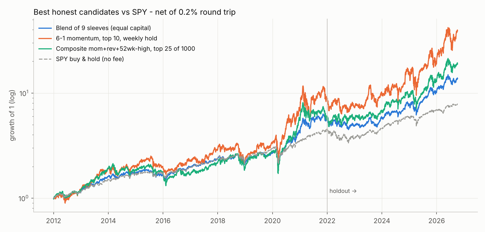
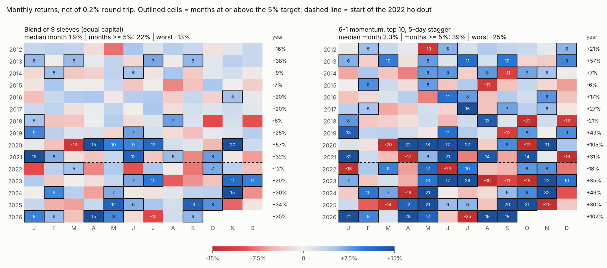
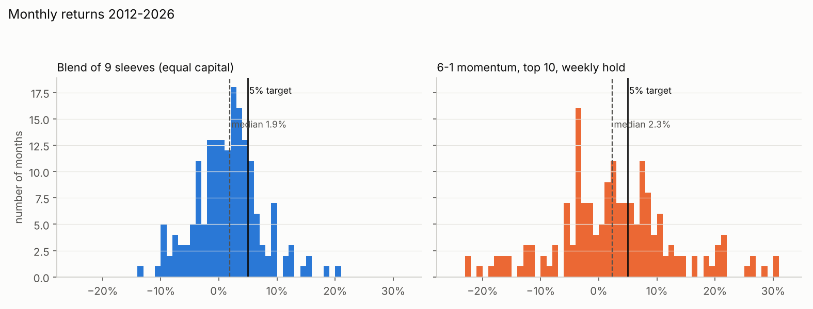
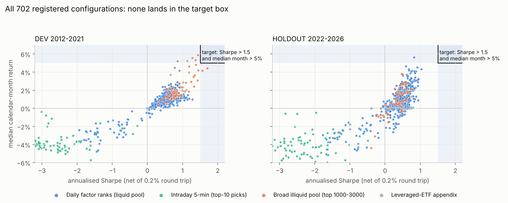

# new-exp - can a long-only, spot, no-leverage stock book make a median >5 % a month at Sharpe >1.5?

Pool: the 6 534 tradable (`os == true`) STOCK/ETF tickers in `data/binance_stocks.json`.  Costs: **0.2 % round trip** on every trade.
Everything is point-in-time (universe re-selected monthly from trailing dollar volume), executed at the next open, and split into
**DEV 2012-2021 / HOLDOUT 2022-Oct 2026**.  Nothing here uses the older BTC/ETH code in the repo.

## Verdict

**The target was not reached, and the evidence says it is not reachable under these constraints.** Out of 840 registered
configurations (702 with a Sharpe) none has Sharpe > 1.5 *and* median month > 5 % in either period
([chart](results/chart_trials_vs_target.png)). What is reachable, with the numbers net of costs:

| Profile | DEV Sharpe / median month | HOLDOUT Sharpe / median month | Max DD | Comment |
|---|---|---|---|---|
| **Best risk-adjusted: equal-capital blend of 9 sleeves** | **1.03** / 1.4 % | **0.89** / 2.9 % | -29 % | no fitted weights; 90 % bootstrap CI of Sharpe [0.55, 1.43], P(Sharpe > 1.5) = 3 % |
| Same blend, weights fitted on DEV (max-Sharpe) | 1.26 / 1.3 % | 0.93 / 1.0 % | -20 % | the extra DEV Sharpe does not carry over |
| **Best growth: 6-1 momentum, top 10, 5-day stagger** | 0.78 / 2.1 % | 0.83 / **5.6 %** | -53 % | median > 5 % only in the 2022-26 AI-led bull; 51 % of holdout months > 5 %, 33 % in DEV |
| Composite (momentum + residual reversal + 52-wk-high), top 25 of 1000 | 0.76 / 1.7 % | 0.83 / 2.2 % | -42 % | |
| SPY buy & hold, no fee (reference) | 1.07 / 1.9 % | 0.75 / 1.3 % | -32 % | no stock-picking sleeve beats SPY's Sharpe in DEV |

So: **Sharpe ~1.0 with a ~2 % median month**, or **median 5 %+ in a bull regime with Sharpe ~0.8 and a -50 % drawdown**. Never both,
and nothing close to 1.5.





## What was tested (all families, all net of 0.2 % RT)

| Round | Family | Configs | Best result | Why it stops |
|---|---|---|---|---|
| 1 | Daily cross-sectional ranks (26 signals x top-10/25 x hold 1/5/21 d x top-300/1000) | 312 | DEV Sharpe 1.28 (low-beta) but HOLDOUT 0.18; best of both 0.78 / 0.86 (residual 12-1 momentum, k=25, 21 d) | single factors top out near Sharpe 0.8-1.0 |
| 2 | Event study (RSI-2 pullback, gap down/up, Donchian, 52-wk-high, leader dip, big-volume days...) | 138 cells | leader-dip +0.4-0.6 % gross per trade over drift; most events = market drift | edge per trade <= 0.6 % |
| 3 | **Intraday 5-min** (momentum / reversal / gap / relative volume / ORB / in-play events, entry 09:35-15:30, exit at close; plus overnight holds from 15:55) | 116 | **best gross edge 9 bp per trade vs 20 bp cost**; overnight <= 17 bp, fading | every net Sharpe is -0.3 to -3.7 ([chart](results/chart_intraday_cost_wall.png)) |
| 4 | Swing trades through a K-slot engine with stops/trails (RSI-2, gap-up, Donchian, 52-wk-high, leaders, dip) | 42 | Sharpe 0.85 (DEV) / 0.81 (HOLDOUT), different configs | |
| D | Walk-forward gradient-boosting ranker (33 features, yearly refit, fixed hyper-parameters) | 6 | Sharpe 0.2-0.5; it mostly buys high-vol names (-60 % DD) | no non-linear alpha found |
| 5 | Sleeves, blends, SPY>SMA200 gate, vol-target | - | blend 1.03 / 0.89 (above) | diversification helps Sharpe, hurts the median |
| 6 | **Broad pool** (top 1000-3000 names) | 72 | DEV Sharpe up to **1.70**, median up to 5.9 % - looks like the target | **trap**, see below |
| 7 | Composites, sector-neutral, gated | 144 | 0.76 / 0.83 | no gain over single factors |
| App. | Leveraged/inverse ETFs (embedded 2-3x leverage; violates the spirit of "no leverage") | 10 | TQQQ buy&hold: DEV median 5.2 %, Sharpe 1.13, DD -69 %; HOLDOUT Sharpe 0.57 | leverage raises the median, not the Sharpe |

## Why it does not work (the arithmetic)

* **The target is a ~40 % annual-vol, Sharpe-1.5 book.** Median 5 %/month and Sharpe 1.5 imply ~11 % monthly volatility and a
  ~70 % month hit-rate. Without leverage the only way to get a 5 % month is to hold the most volatile names, and then Sharpe is set by
  stock-level alpha, which here is small.
* **Alpha per trade is tiny next to 0.2 %.** Events are worth +0.1 to +0.6 % over drift; intraday signals earn <= 9 bp gross. The
  turnover needed for 5 %/month (4-6 turns) costs 0.8-1.2 % a month in fees alone.
* **Breadth is bounded.** Back-of-envelope with the fundamental law: Sharpe ~ IC x sqrt(breadth) x transfer-coefficient. For a long-only book of the 300-1000
  most liquid names with realistic ICs (~0.01-0.02 per 5 days) that is ~1.0-1.3 *before* the higher-vol/low-liquidity names are priced
  honestly - matching the 0.8-1.26 seen here.
* **Selection on DEV does not predict HOLDOUT in the places where DEV looks best.** Spearman(dev Sharpe, holdout Sharpe) across the 72
  broad-pool configs is **-0.03**; across liquid-pool daily configs it is 0.5 only because all of them carry market beta.

### The near-misses are traps

Orange dots near the box (DEV only) are the **broad pool**: top-3000 names, e.g. 5-day reversal, 10 names, 21-day stagger -> DEV Sharpe
1.70, median 4.4 %, mean 5.7 %/month; or highest-volatility 10 names -> DEV median 5.9 %, mean 13 %/month. They fail because
1. HOLDOUT Sharpe is 0.38 and -0.29 - the DEV edge does not persist;
2. the held names have Corwin-Schultz spread estimates of **150-250 bp** (average ADV $9-43 M), 10x the assumed cost - with 50 bp/side slippage
   the reversal sleeve is 1.31 DEV / 0.07 HOLDOUT (`results/stress_broad.csv`);
3. the pool is today's ticker list, so every name that crashed and delisted is missing - this inflates exactly the high-volatility,
   dip-buying designs. The liquid top-300/1000 results are the least exposed to this; none of the broad-pool numbers should be trusted.

## Validation of the finalists (`src/final_validation.py`, `results/final_*`)

| Check | Blend of 9 | 6-1 momentum k10 | Composite k25 (top-1000) |
|---|---|---|---|
| Sharpe DEV / HOLDOUT / all | 1.03 / 0.89 / 0.97 | 0.78 / 0.83 / 0.78 | 0.76 / 0.83 / 0.78 |
| costs x2 (0.4 % RT) | 0.92 / 0.81 | 0.70 / 0.78 | 0.68 / 0.77 |
| costs x4 (0.8 % RT) | 0.69 / 0.64 | 0.56 / 0.68 | 0.54 / 0.65 |
| +1 day execution lag | 0.99 / 0.91 | 0.77 / 0.85 | 0.76 / 0.82 |
| universe re-selected quarterly / yearly instead of monthly (DEV Sharpe) | 1.04 / 0.93 | 0.72 / 0.73 | 0.73 / 0.67 |
| placebo: 100 random-rank portfolios, same universe/k/h/costs | - | mean 0.29, max 0.44 -> p < 0.01 | mean 0.63, max 0.68 -> p < 0.01 |
| bootstrap 90 % CI of full-sample Sharpe (21-day blocks) | [0.55, 1.43] | [0.40, 1.19] | [0.41, 1.21] |
| P(Sharpe > 1.5) / P(median month > 5 %) | 3 % / 0 % | 0.3 % / 0 % | 0.2 % / 0 % |
| deflated Sharpe (504 comparable trials, SR0 = 1.6) | 0.03 (DEV) | 0.00 | 0.00 |
| forward window 2026-06-11 -> 10-07 (82 days, inside the holdout) | +1.7 %, Sharpe 0.32 | **+10.6 %**, Sharpe 0.78, DD -39 % | +2.1 %, Sharpe 0.37 |

Reading: the sleeves have a *real* but modest edge over random stock selection (placebo p < 0.01) that survives 4x costs and a 1-day lag,
and is not an artefact of the universe rule. It is not distinguishable from "best of 500 tries" at the Sharpe level (deflated Sharpe ~ 0), and
it does not beat SPY's risk-adjusted return in DEV. The momentum sleeve's 5 %+ median in the holdout is a regime result.

Look-ahead guards: `tests/test_engines.py` (alignment, fees, stops on synthetic data) and `tests/test_truncation.py` (every feature and every
universe membership computed on a panel cut at 2019-06-28 equals the full-panel value - passes).

## Binance stock tokens (the real instruments)

* ~91 stock/ETF tokens trade on Binance spot (`<TICKER>BUSDT`), but only since **2026-06 .. 07**, so they cannot be used for research - only for
  realism: touch spreads median ~6 bp (0.06-81 bp), but **top-of-book depth is $5-$7 000 (most < $500)** and average daily volume $0.03-18 M per token. Capacity is
  tiny; any strategy above a few thousand dollars per name would pay far more than 0.2 %.
* Token vs underlying outside US hours (`src/token_basis.py`, 17 tokens, 41 days): median basis +4 bp, 5-95 % range -8..+17 bp, convergence
  slope to the open -0.75 (t = -1.9). Only 164 observations (clustered) show a discount > 20 bp (mean +31 bp to the open). The token market is
  efficiently anchored to the underlying; no basis strategy clears 20 bp.

## Data / reproduce

Not in git (large; rebuilt by the scripts): Yahoo daily OHLCV for all 6 534 tickers (`fetch_daily.py`), 1-minute US-equity bars
from the public Hugging Face set `mito0o852/OHLCV-1m` aggregated to 5 minutes for the 1 111 names that were ever in the PIT top-500
(`fetch_minute.py`, data ends 2026-03), Binance token klines from `data-api.binance.vision` (`fetch_binance_tokens.py`; the regional
`api.binance.com` returns HTTP 451). **No API keys are needed or used** - the keys pasted into the chat were not used and should be revoked.

```
python src/fetch_daily.py; python src/fetch_binance_tokens.py
python src/fetch_minute.py data/minute_tickers.txt 2016-01 2026-03 3; python src/build_arrays.py 500; python src/intraday_panel.py 300
python tests/test_engines.py; python tests/test_truncation.py
python src/scan_daily.py 300; python src/scan_daily.py 1000; python src/scan_events.py 300; python src/intraday_explore.py
python src/intraday_overnight.py; python src/run_slots.py 300; python src/ml_walkforward.py 500 5; python src/sleeves.py; python src/blend.py
python src/scan_broad.py; python src/stress_broad.py; python src/composites.py; python src/letf_appendix.py; python src/token_basis.py
python src/final_validation.py; python src/dsr.py; python src/intraday_gross.py; python src/charts.py; python src/chart_heatmap.py
```
Pre-registration and its after-the-fact amendments: [`PREREGISTRATION.md`](PREREGISTRATION.md). Every configuration run: `results/trials.csv`.

## Caveats (read these)
* **Survivorship**: the pool is today's list. Large-cap results (top 300/1000) are least affected; broad-pool and high-volatility numbers are inflated.
  A rough drag for the top-1000 book (6 % a year of holdings dying at -70 %) would be ~4 %/yr.
* The holdout is not blind in the strict sense (the author model knows market history to mid-2026); parameters came from priors, not tuning, to limit this.
  Rounds 5-7 and the blends were chosen after seeing rounds 1-4 (disclosed, weights fitted on DEV only).
* Yahoo split/dividend adjustments and the one-day-spike cleaner are assumed correct; minute data is Finnhub-sourced (matches Yahoo opens/closes within ~1 bp).
* Costs are the flat 0.2 % given; real fills at the open of thinner names, taxes and capacity are not modelled. Untested: shorting / leverage (excluded by the brief),
  earnings-surprise and fundamental data (not available in bulk), order-book data, maker rebates.
* What would change the answer: an intraday venue with round-trip costs of ~5 bp or less (the best gross intraday edge is 9 bp), or permission to short/lever a
  market-neutral book (not tested here), or a much lower target (Sharpe ~1, median ~2 %/month is where the honest evidence points).
